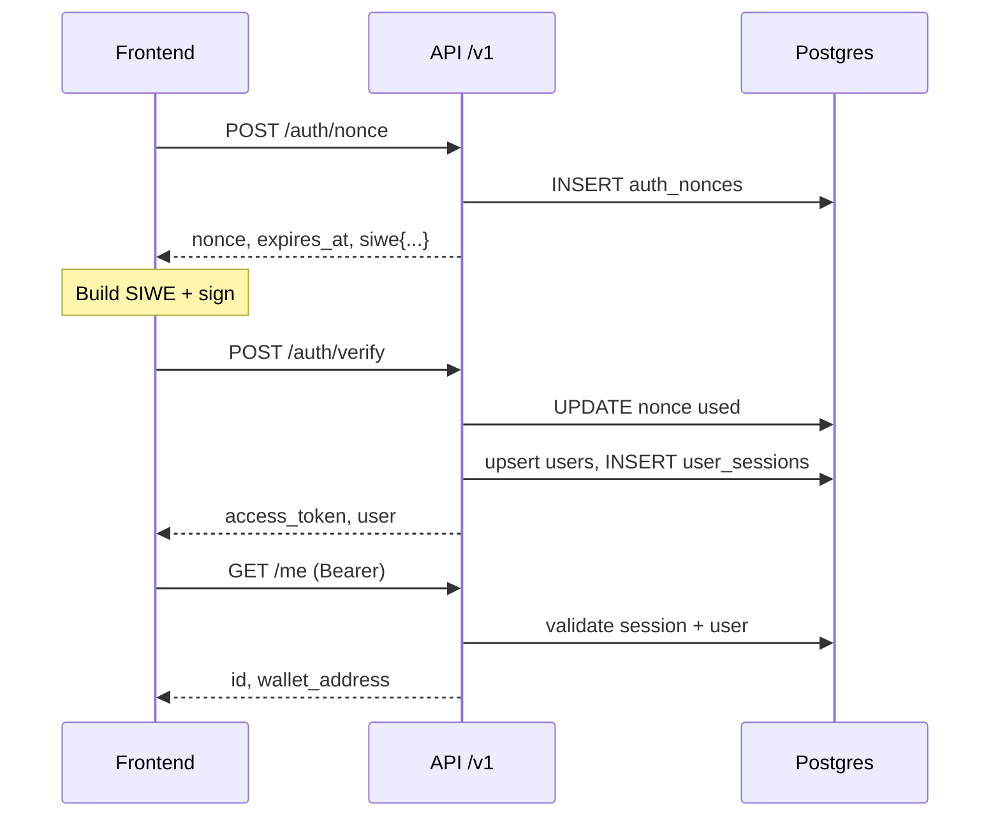

# Identity & HTTP auth (SIWE + JWT)

This document describes wallet login using **EIP-4361 (SIWE)**, **JWT (HS256)** issuance, **single-use nonces**, and **revocable sessions** backed by Postgres.

Source layout: bounded context `internal/identity/`; HTTP API in `internal/identity/interfaces/http/`; composition root `cmd/api/main.go`.

---

## End-to-end flow

1. **Nonce** — Client sends a wallet address → server creates a UUID nonce, persists it, returns expiry plus SIWE hints (`domain`, `uri`, `chainId`, optional `statement`).
2. **Sign SIWE** — Client builds an EIP-4361 message using that `nonce` and fields that match server config, then signs with the wallet.
3. **Verify** — Client sends `message` + `signature` → server verifies SIWE, marks the nonce consumed, upserts `users`, inserts `user_sessions` (by `jti`), returns a JWT.
4. **Authenticated API** — `Authorization: Bearer <token>` → middleware parses the JWT, checks the session is not revoked and the user is active.
5. **Logout** — Revokes the current session by `jti` (`204`, no body).




---

## Environment variables


| Variable                 | Required | Default / notes                                                                           |
| ------------------------ | -------- | ----------------------------------------------------------------------------------------- |
| `DATABASE_URL`           | Yes      | Postgres connection string (pgx).                                                         |
| `JWT_SECRET`             | Yes      | HMAC key for JWT HS256.                                                                   |
| `SIWE_DOMAIN`            | Yes      | Must match SIWE message `domain` (e.g. `localhost`).                                      |
| `SIWE_URI`               | Yes      | Must match message `uri` after normalization (server strips trailing `/` when comparing). |
| `HTTP_ADDR`              | No       | Default `:8080`.                                                                          |
| `SIWE_CHAIN_ID`          | No       | Default `8453` (Base mainnet); override for devnets.                                      |
| `SIWE_STATEMENT`         | No       | If set, the SIWE message must include the same statement.                                 |
| `AUTH_NONCE_TTL_MINUTES` | No       | Default 5 minutes.                                                                        |
| `AUTH_JWT_TTL_DAYS`      | No       | Default 7 days.                                                                           |


Database schema: `migrations/00001_auth_schema.up.sql` (`users`, `auth_nonces`, `user_sessions`).

---

## Endpoints

Base path: `**/v1**`. The `cmd/api` process also exposes `**GET /health**` (JSON `{"status":"ok"}`) on the root router.

### `POST /v1/auth/nonce`

Issues a nonce and metadata the frontend uses to construct SIWE.

**Request** (`application/json`):

```json
{
  "wallet_address": "0x..."
}
```

**Response** `200`:


| Field            | Type   | Meaning                                                                                            |
| ---------------- | ------ | -------------------------------------------------------------------------------------------------- |
| `nonce`          | string | Server UUID; must appear as the SIWE message `nonce`.                                              |
| `expires_at`     | string | RFC3339Nano.                                                                                       |
| `siwe.domain`    | string | Matches `SIWE_DOMAIN`.                                                                             |
| `siwe.uri`       | string | Matches `SIWE_URI` (normalized).                                                                   |
| `siwe.chainId`   | number | Matches `SIWE_CHAIN_ID`.                                                                           |
| `siwe.statement` | string | Omitted unless `SIWE_STATEMENT` is configured; include the same value in the message when present. |


**Errors**

- `400` — Invalid JSON or `{"error":"invalid wallet_address"}`.
- `500` — `{"error":"server error"}`.

---

### `POST /v1/auth/verify`

Verifies the SIWE signature, consumes the nonce, creates a session and JWT.

**Request**:

```json
{
  "message": "<full EIP-4361 string>",
  "signature": "0x..."
}
```

**Response** `200`:

```json
{
  "access_token": "<JWT>",
  "expires_at": "<RFC3339Nano>",
  "user": {
    "id": "<user UUID>",
    "wallet_address": "0x... lowercase"
  }
}
```

**Errors**

- `400` — Invalid JSON body.
- `401` — `{"error":"authentication failed"}` (bad SIWE, wrong/expired/reused nonce, etc.).
- `403` — `{"error":"authentication failed"}` when the user exists but `is_active = false`.

---

### `GET /v1/me`

**Auth:** `Authorization: Bearer <access_token>`.

**Response** `200`:

```json
{
  "id": "<user UUID>",
  "wallet_address": "0x..."
}
```

**Errors:** `401` / `403` from middleware (`{"error":"unauthorized"}` or `{"error":"forbidden"}`).

---

### `POST /v1/auth/logout`

**Auth:** Bearer as above.

**Response:** `204 No Content` (empty body).

**Errors:** `401`, or `500` with `{"error":"server error"}`.

---

## JWT (HS256)

- Signed with `JWT_SECRET`.
- Custom JSON claims: `uid` (user UUID), `wallet` (address).
- `sub` (subject) = user UUID string.
- `jti` = session id (`RegisteredClaims.ID`); used for revocation in `user_sessions`.

After logout, the token may still be within `exp`, but `**revoked_at` is set** on the session row, so `Authenticate` rejects it.

---

## `curl` examples

Assuming the API listens on `http://localhost:8080`.

```bash
# Nonce
curl -sS -X POST http://localhost:8080/v1/auth/nonce \
  -H 'Content-Type: application/json' \
  -d '{"wallet_address":"0x0000000000000000000000000000000000000001"}'

# Verify (message + signature from the wallet after signing SIWE)
curl -sS -X POST http://localhost:8080/v1/auth/verify \
  -H 'Content-Type: application/json' \
  -d '{"message":"...","signature":"0x..."}'

# Me
curl -sS http://localhost:8080/v1/me \
  -H "Authorization: Bearer <access_token>"

# Logout
curl -sS -X POST http://localhost:8080/v1/auth/logout \
  -H "Authorization: Bearer <access_token>" -i
```

---

## Frontend integration checklist

1. Call `/auth/nonce` → read `nonce` and the `siwe` object.
2. Build the SIWE message so `**nonce**`, `**domain**`, `**uri**`, `**chainId**` (and `statement` when the server returns it) match the server.
3. Sign the message → call `/auth/verify` → store `access_token` (in-memory or httpOnly cookie, depending on your app).
4. Send `Authorization: Bearer` on protected routes.

---

## Related files (quick reference)


| Role              | Path                                                |
| ----------------- | --------------------------------------------------- |
| `/v1` router      | `internal/identity/interfaces/http/router.go`       |
| JSON handlers     | `internal/identity/interfaces/http/auth_handler.go` |
| Bearer middleware | `internal/identity/interfaces/http/middleware.go`   |
| Request `context` | `internal/identity/interfaces/http/context.go`      |
| Use cases         | `internal/identity/application/auth_service.go`     |
| SIWE verification | `internal/identity/application/siwe_login.go`       |
| Ports             | `internal/identity/application/ports.go`            |
| SQL adapters      | `internal/identity/infrastructure/persistence/*.go` |
| JWT signer        | `internal/identity/infrastructure/tokens/signer.go` |
| API entrypoint    | `cmd/api/main.go`                                   |
| Config            | `internal/shared/config/config.go`                  |


---

## Security & operations notes

- Nonces are **single-use**: `Consume` succeeds only when the wallet matches, `used_at` is null, and `expires_at` is still in the future.
- There is no global deny list beyond the `user_sessions` table; rotating `JWT_SECRET` invalidates all outstanding tokens.
- Run the auth migration before calling these endpoints (see `migrate-auth-up` in `backend/Makefile`).

