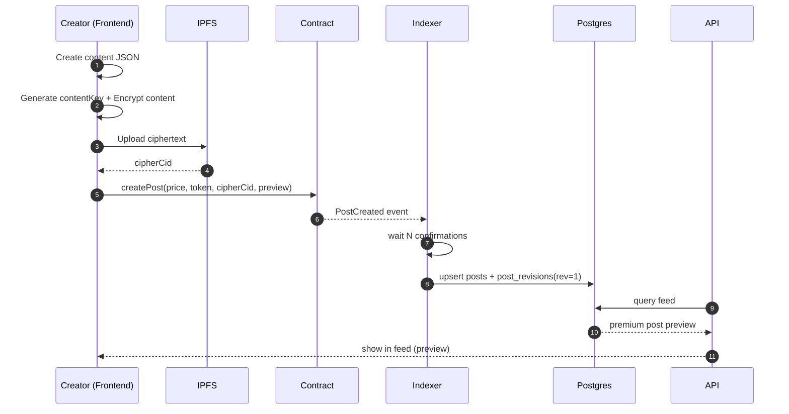
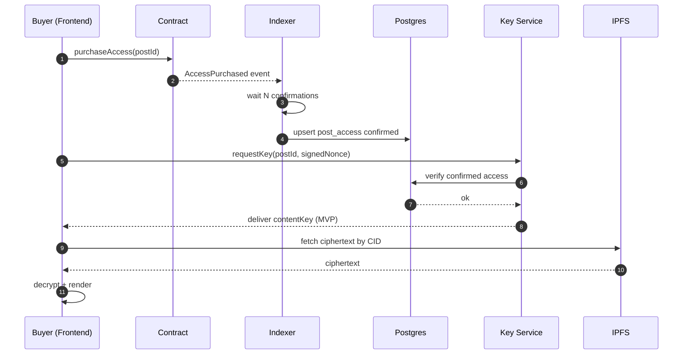
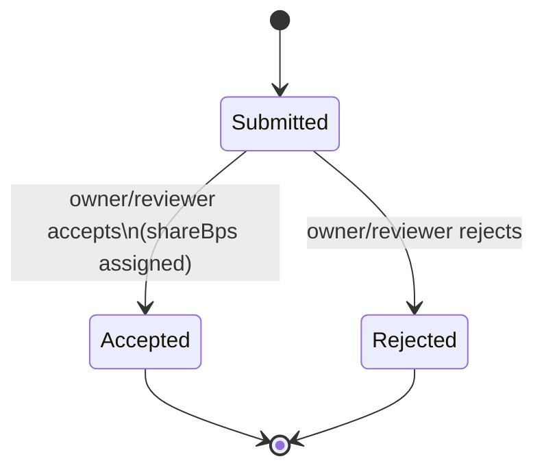

# 05) Flows — End-to-end workflows + flowcharts

## 1. Publish premium post flow



## 2. Purchase + read premium post (MVP key server)



## 3. Contribution lifecycle



## 4. Indexer ingestion flow (idempotent)

```mermaid
flowchart TD
  A[Receive event log] --> B{Seen (chain_id, tx_hash, log_index)?}
  B -- yes --> Z[Skip]
  B -- no --> C[Insert chain_events row]
  C --> D{Event type}
  D -- PostCreated/PostEdited --> E[Upsert posts + revisions]
  D -- AccessPurchased --> F[Upsert post_access confirmed]
  D -- ContributionSubmitted --> G[Insert contribution submitted]
  D -- ContributionAccepted --> H[Mark accepted + update recipients]
  E --> Y[Commit]
  F --> Y
  G --> Y
  H --> Y
  Y --> X[Publish WS notification (optional)]
```

## 5. Reorg handling (conceptual)
- Indexer only marks events “confirmed” after N confirmations.
- If a reorg is detected (block hash mismatch), it should:
  - rollback rows from orphaned blocks (or mark them `reverted`)
  - backfill from a safe checkpoint

