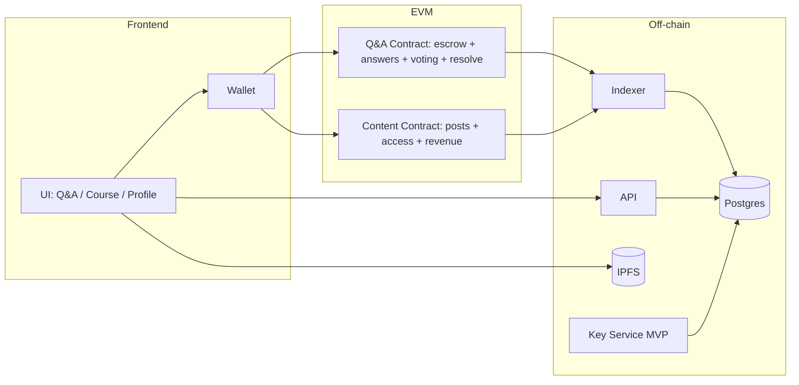
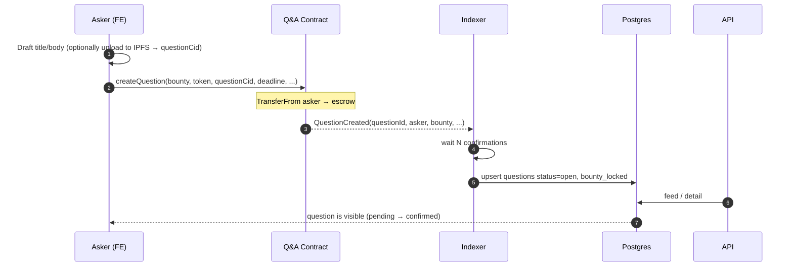
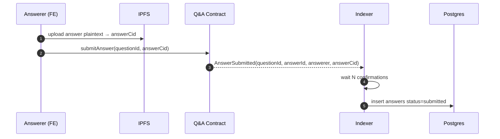
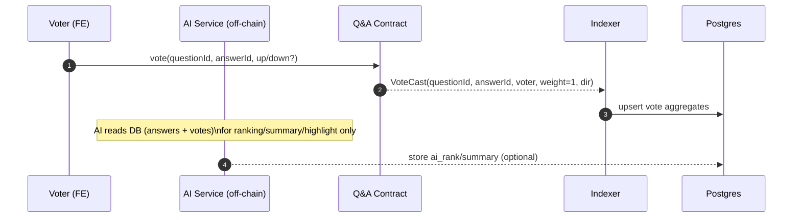
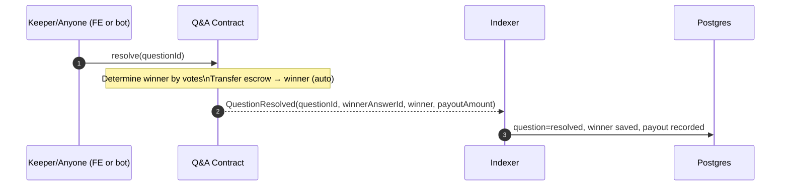
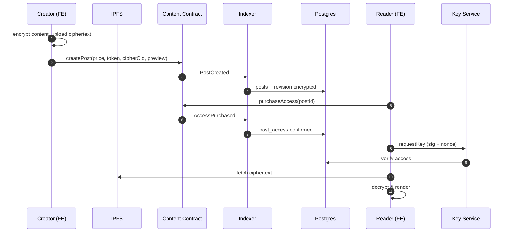
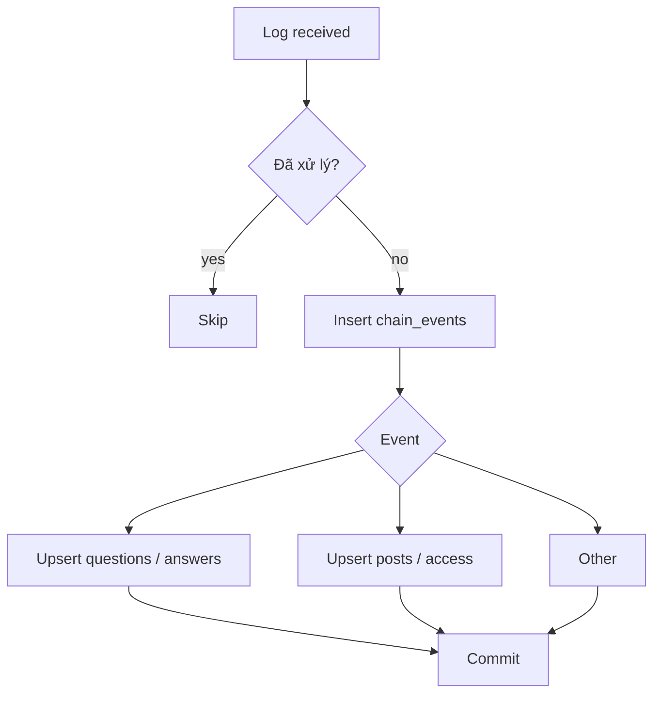

# Flow design — Web3 Q&A + Premium Content (MVP)

This document describes the **domain analysis** and **end-to-end flows** for the project, aligned with:
- Running on an existing **EVM chain** (e.g. Base / Arbitrum / Polygon).
- **Q&A**: pay to **ask**; answers are **free**; **voting selects winner/payout** after the deadline (no asker accept needed).
- **AI**: UX-only **ranking + summary + highlights**; **never** affects payouts.
- **Courses / premium posts**: paid content (e.g. pay-per-view in USDC), ciphertext on IPFS, access granted by on-chain purchase (see `docs/05-flows.md` and `docs/spec/encryption-and-keys.md`).
- **Proof of ownership**: out of scope for the MVP flows below (can be added later).

---

## 1. Domain breakdown (bounded contexts)

| Context | Purpose | Primary source of truth |
|------|----------|---------------------|
| **Q&A** | Bounty-based Q&A (escrowed bounty) | Contract (escrow) + events; DB read model |
| **Content / Courses** | Premium content, paid access | Contract `hasAccess` + events; IPFS ciphertext |
| **Identity** | Wallet profile + signed sessions | API + DB `users` |
| **Indexer** | Sync state with N confirmations + idempotency | `chain_events` |

**Actors:** Guest · Asker (pays to ask) · Answerer (free) · Voter · Reader/Buyer · Creator · Platform (API, indexer, key service MVP).

---

## 2. System diagram

---

## 3. Flow A — Create a bounty question (pay to ask)

**Goal:** The asker locks **USDC** (or the chosen token) in **escrow** tied to `questionId`. At the **deadline**, the contract **resolves** by voting and **auto pays the bounty** (or triggers fallback if there are no valid votes).

**Suggested DB states:** `open` → `resolved` (after resolve) or `expired` / `refunded` based on fallback rules.

---

## 4. Flow B — Trả lời (miễn phí) + hiển thị

**Goal:** Answerers **do not pay** (besides gas, or meta-tx later). Content can be **lightweight on-chain** (hash/CID) or **off-chain** (IPFS CID) depending on gas budget — MVP typically stores `answerCid` on-chain via events.

---

## 5. Flow C — Voting (1 wallet = 1 vote) + AI hỗ trợ UX

**Goal:** The community votes to select the winner. **AI** is UX-only (ranking/summary/highlights) and does not affect payouts.

**Rule (MVP):** 1 wallet = 1 vote. (V2: stake-based / reputation-weighted voting)

---

## 6. Flow D — Resolve sau deadline + Auto payout

**Goal:** After the deadline, the contract selects the winner by vote totals and **auto pays the bounty** from escrow (no asker action needed). If no valid votes → run fallback rule (refund / treasury / extend).

**Gợi ý fallback (chọn 1 trong spec):**
- **Refund** cho asker nếu voteCount = 0, trừ platform fee
- Hoặc **treasury** (quỹ) nếu voteCount = 0
- Hoặc **extend** deadline một lần

---

## 7. Flow E — Courses / Premium: publish → purchase → read

Căn chỉnh với `docs/05-flows.md`: tạo post premium → `purchaseAccess` → indexer confirm → Key Service (MVP) → decrypt client-side.

---

## 8. Flow F — Indexer (chung cho mọi event)

Giữ nguyên nguyên tắc trong `docs/05-flows.md`: idempotency `(chain_id, tx_hash, log_index)`, confirmations **N**, xử lý reorg/backfill.

---

## 9. Bảng mapping event → hành động (draft)

| Event (draft name) | Hành động DB / UX |
|--------------------|-------------------|
| `QuestionCreated` | Insert `questions`, bounty locked |
| `AnswerSubmitted` | Insert `answers` |
| `VoteCast` | Update vote aggregates, ranking |
| `QuestionResolved` | Mark winner, question resolved, ghi payout |
| `PostCreated` / `PostEdited` | Upsert posts / revisions |
| `AccessPurchased` | `post_access` confirmed |

Final event names and payloads are defined in `docs/spec/events.md` and the contracts; you can add `docs/spec/qa-events.md` during Q&A implementation.

---

## 10. Trang (information architecture) — gợi ý

| Route / khu vực | Nội dung |
|-----------------|----------|
| **Home** | Giới thiệu, connect wallet, link tới Q&A / Courses / Profile |
| **Q&A list / detail** | Questions feed, bounty, deadline, answers, vote UI, resolved status |
| **Courses** | Premium feed, preview, buy, read after decrypt |
| **Profile** | Wallet, stats (questions, wins, spend) |

---

## 11. Risks & decisions to lock before coding

1. **Sybil / self-dealing:** 1 wallet = 1 vote vẫn bị Sybil khi dự án nhỏ → cần roadmap V2: stake-based / reputation-weighted.  
2. **No one calls resolve:** if `resolve()` is permissionless, you still need a keeper/bot to ensure questions always finalize.  
3. **Độ dài nội dung trên chain:** ưu tiên **CID** cho body dài; chỉ hash/metadata on-chain nếu cần.

---

## Internal references

- Architecture: `docs/02-architecture.md`  
- Premium + indexer flows: `docs/05-flows.md`  
- Encryption & key MVP: `docs/spec/encryption-and-keys.md`  
- Events: `docs/spec/events.md`  
- Base data model (posts/access): `docs/03-data-model.md` — Q&A adds `questions`, `answers`, `answer_votes`.

- If there is no payout, funds can go to a treasury. That treasury can be used to maintain the system, fund grants/charity, etc.