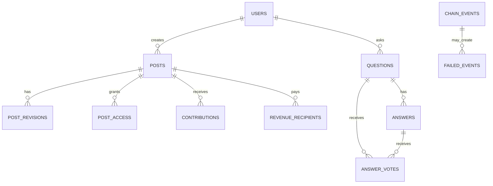

# Data model map — Entities & relationships

## ER-ish overview (logical)

## On-chain vs off-chain

| Object | On-chain (source of truth) | Off-chain (read model) |
|--------|----------------------------|-------------------------|
| Q&A | bounty escrow, votes, resolve | `questions/answers/answer_votes` |
| Premium | access purchase, recipients | `posts/post_access/revenue_recipients` |
| Content | CID pointers, revisions | cached metadata, previews |

