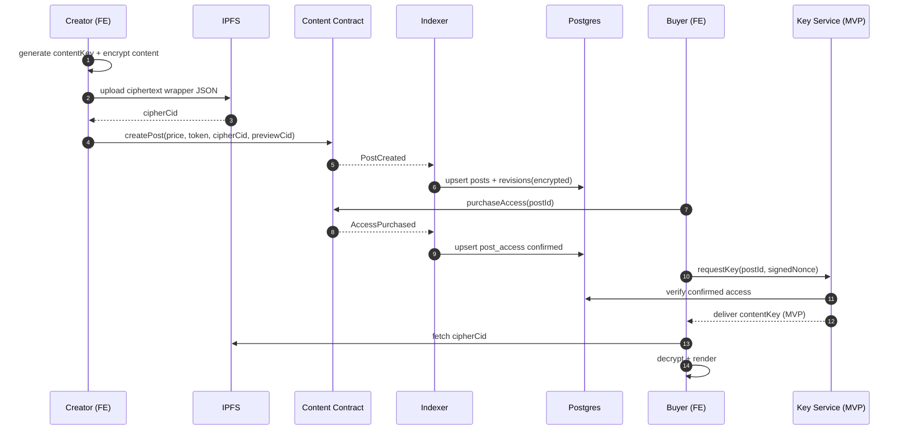

# Premium flow — Create → Purchase → Key → Decrypt

## Sequence (MVP key service)

## Trust boundaries

| Boundary | Assumption | Mitigation |
|----------|------------|------------|
| Key Service | Trusted in MVP (can leak keys) | audit logs, V2 threshold/Lit |
| IPFS | Public storage (ciphertext) | never store premium plaintext |
| Client | Can leak after decrypt | accepted non-goal (no DRM) |

