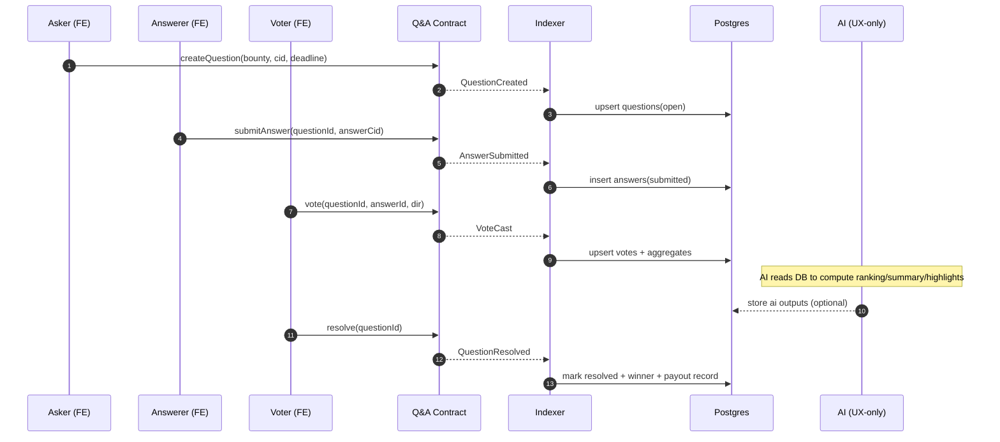
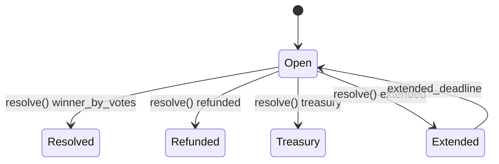

# Q&A core flow — Ask → Answer → Vote → Resolve → Payout

## Flowchart

```mermaid
flowchart TD
  A[Asker creates question\nlock bounty + deadline] --> B[Answers submitted\nCID/IPFS or text]
  B --> C[Voting period\n1 wallet = 1 vote]
  C --> D{Deadline reached?}
  D -- no --> C
  D -- yes --> E[Resolve (permissionless / keeper)]
  E --> F{Any valid votes?}
  F -- yes --> G[Winner = top votes\nAuto payout bounty]
  F -- no --> H[Fallback\nrefund / treasury / extend]
  G --> I[Question status = resolved]
  H --> I
```

## Sequence (on-chain + indexer)



## State machine



## AI UX guardrail

| AI output | Inputs | Impact |
|----------|--------|--------|
| Ranking | answers + votes | UX only |
| Summary | answers thread | UX only |
| Highlights | answer comparisons | UX only |

